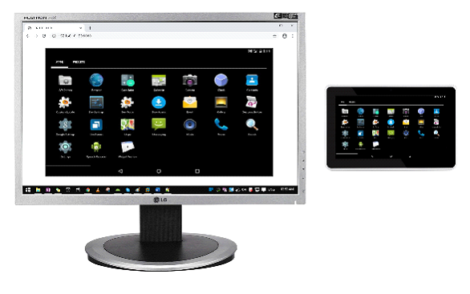

# Screen-Caster

# Introduction
This is a group of apps that broadcast screens to any web browsers.
I made 3 apps for Android, iOS and Mac.
These apps create web sockets internally, and broadcast screens via web sockets.
So, users can see the Android screen, iOS screen or Mac screen in any other web browsers.

